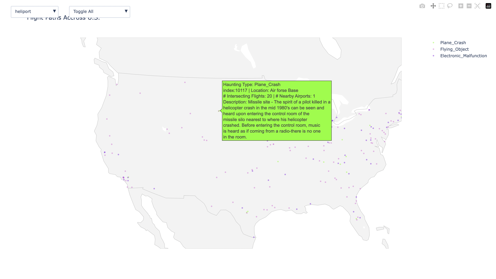
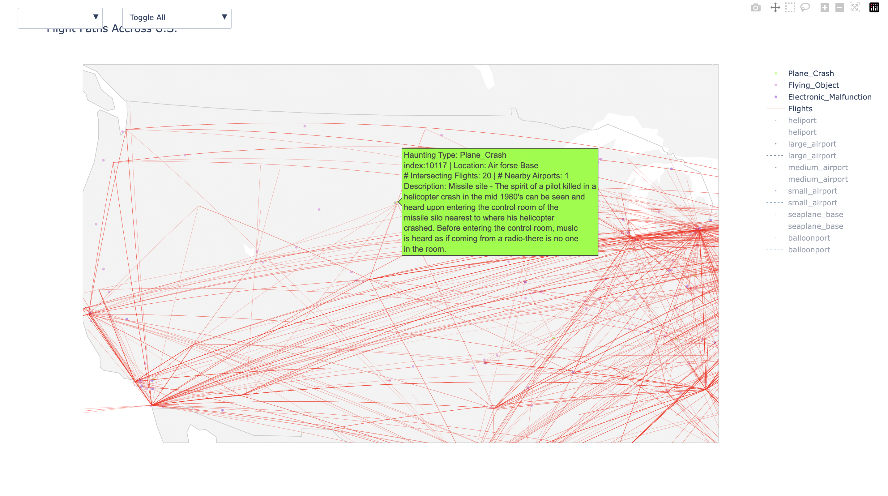
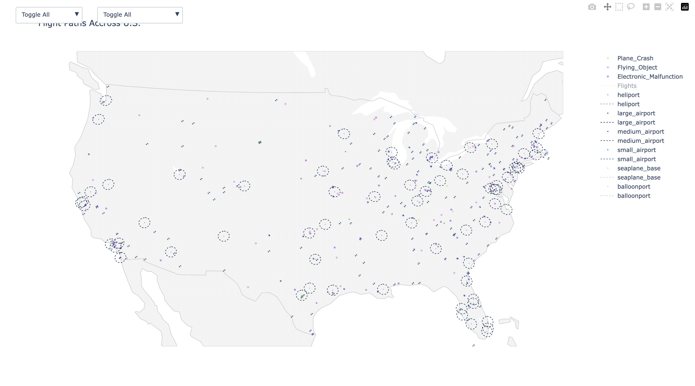
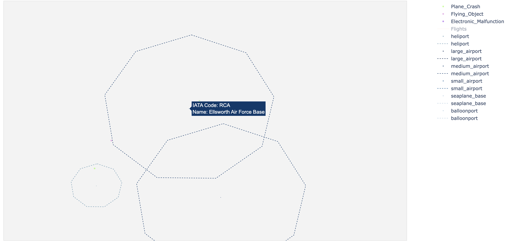
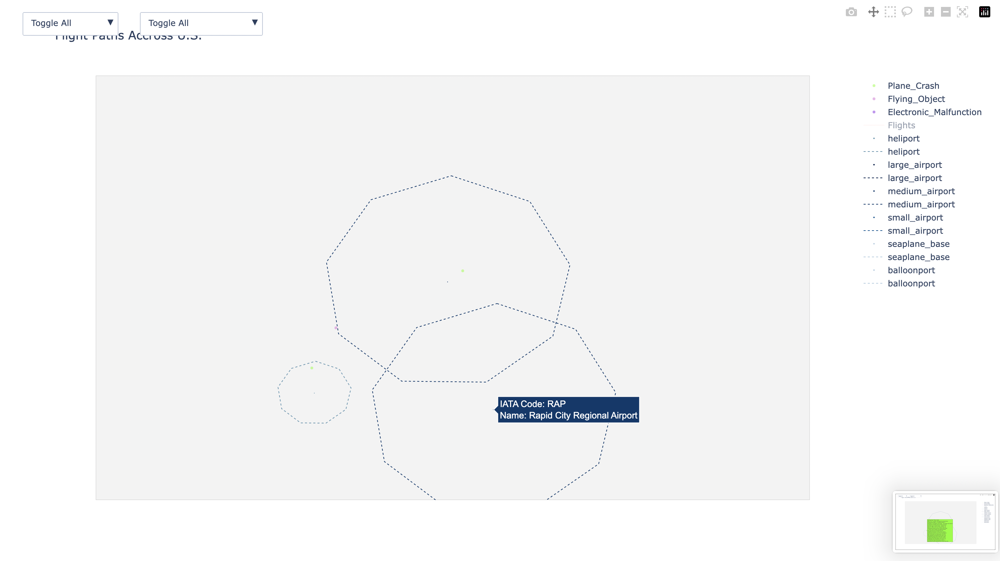
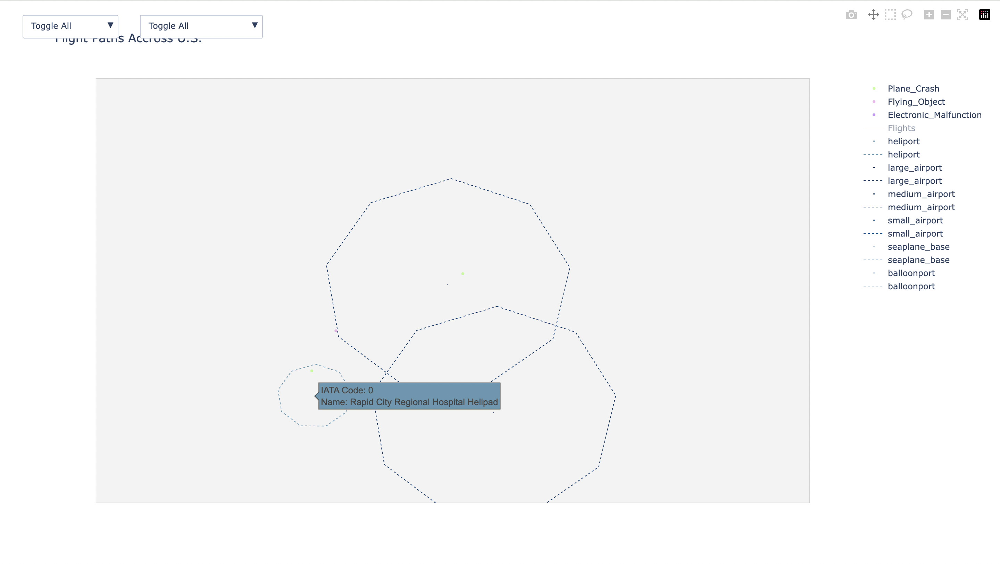
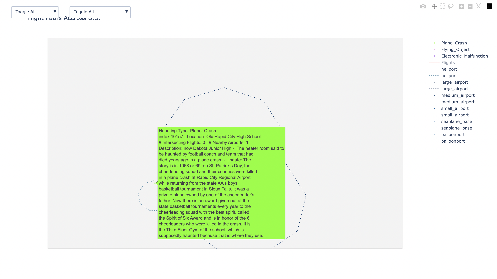
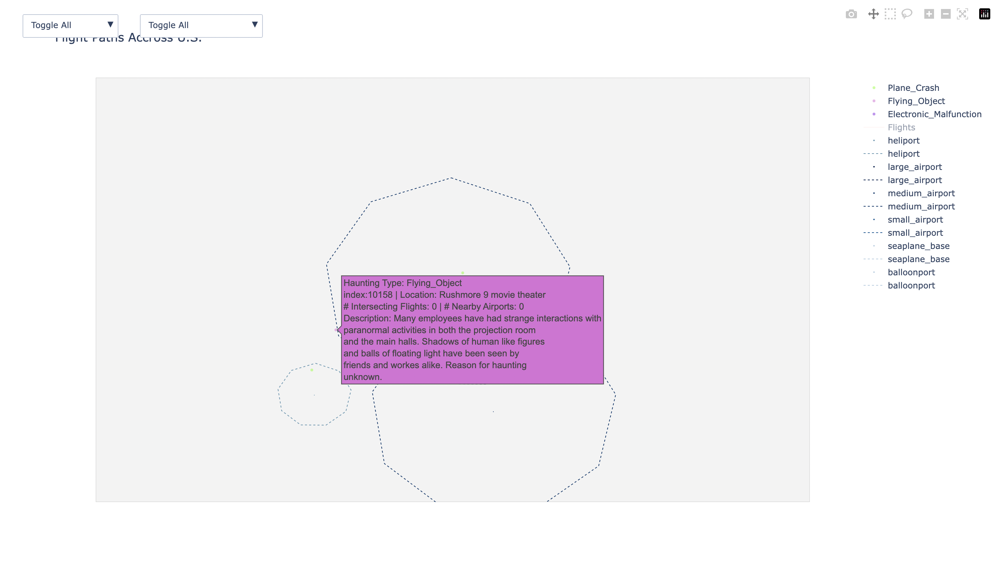

# Visualization Example

After running **notebooks 3.01-3.02** (hopefullly they work), you should have two new html files:
- airborne_events.html
    - plots
    - you can go into the code and change what events you want to filter by
- topTen.html

## **airborne_events.html**

Plots all haunted events with an **"Event_Type"** of *{"Plane_Crash", "Electronic_Malfunction", "Flying_Object"}*

- You can edit the code in [Notebook 3.01](notebooks/3.01-dg-haunted_places-airborne_events_plot.ipynb) if you want to filter by different event types

### **Pretty Pictures**

Data science is all about pretty pictures. Let's look at some:

Here is the map with all 3 event types we selected. 

- you can see *{"Plane_Crash", "Electronic_Malfunction", "Flying_Object"}* in the **legend** on the right. Each event is colored by a spooky color scheme. 
- This entry seems interesting ... **Spirit of pilot killed in helicopter crash?** 
    - This entry has **over 20 flight intersections** and **1 nearby airport**

**let's verify this.**

First, we toggle flight paths:

- Alright ... a bit harsh on the eyes, but still cool!
    - NOTE: I filter out non-intersecting flights. If I plotted all ~10,000 flight routes, the entire screen would be red. 
- You can see all the intersecting flights with our haunted place. It looks like there are a lot by our entry of interest. 

Now, we toggle on airports: 

- I filter only for airports that intersect with our haunted place. 
- You can see each airport's **name** and **IATA code**.
- You can see each airport type in the **legend** on the right
    - You can add or remove airports by type by clicking the toggle button or legend. 
- I use [generate_circle](dsci_550_a1/flightFunctions.py) to compute each airport's radius of influence.

**Okay** back to the analysis... let's take a closer look at our haunted place.

- Sure enough there are **2 nearby airports** and a **heliport**

**ellesworth_airforce_base**

**rapid_regional_airport**

**rapid_regional_heliport**

- Looks like the spirit of our pilot lies in the **ellesworth_airforce_base**. That's not the only airborne related event!

**Dakota Junior High School Football team**

- in 1968, an **entire football team and their coach** died in a plane crash at *rapid_regional_airport*.

**Floating Orbs?**

- "many employees" at the *Rushmore 9 move theater* are also seeing **shadowy figures** and **floating lights**.

Are these the ghosts of the Dakota Junior High School Football team? **OR** are they lights from the nearby [rapid_regional_heliport](reports/figures/airborne_events_eg_figs/rapid_regional_helipad.png)? **I'll let you be the judge :).**

#### Conclusion

I could show you pictures all day, but it's much more fun to play with the tool. Try compiling the html and running it on your computer!
- Run notebooks [0.01](notebooks/0.01-dg-raw_data-fillna_init_output.ipynb), [0.02](notebooks/0.02-dg-raw_data-data_cleaning.ipynb), [0.03](notebooks/0.03-dg-raw_data-entry_viewer.ipynb) to get cleaned haunted_places Dataset. 
- [Run Notebook 2.01](notebooks/2.02-rm-alcohol_abuse-join.ipynb) to get **flight_intersection** and **airport_intersection** data.

## **airborne_events.html**

Plots top 10 most haunted flights and 10  most haunted airports for each airport type.

- Counts caluculated in [Notebook 3.00](notebooks/3.00-dg-airport_intersections-counts.ipynb)

## Final Notes

- I did not include html file outputs on the github because I didn't want to upload mbs of data to github. 
- I am not a software developer, and I tried my best to make everything compile neatly. If something does not work, please [email me](@dlgottsc@usc.edu) and I will fix any issue. 
- Have fun!!!